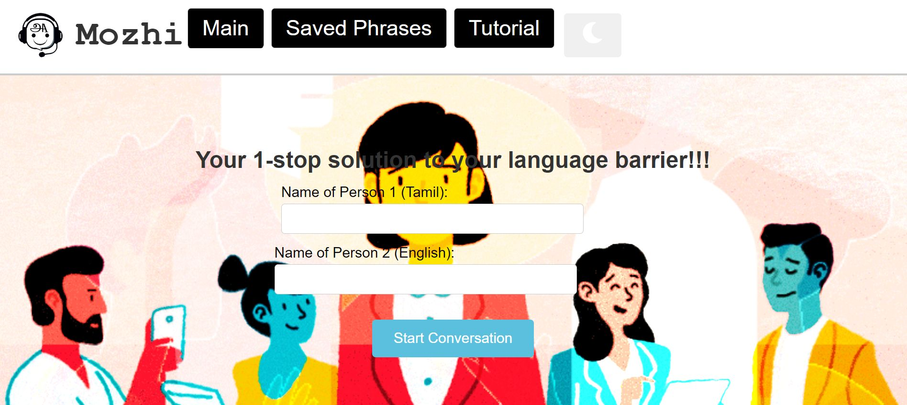
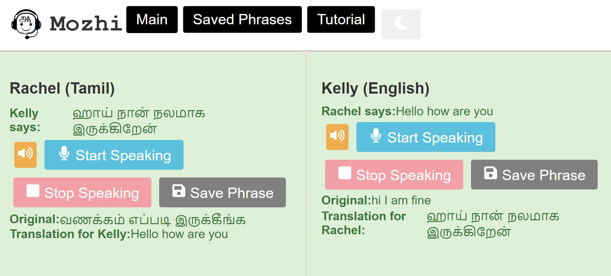

# Mozhi - Tamil-English-Tamil Speech Translation App

## Overview

Mozhi is a language translation application designed to facilitate communication between speakers of Tamil and English languages. The app uses speech recognition to capture spoken words, translates them in real-time, and provides audio feedback. It supports Tamil and English, making it a useful tool for breaking language barriers.

## Screenshots






## Features

- **Speech Recognition**: Capture spoken words in real-time.
- **Real-time Translation**: Translate between Tamil and English instantly.
- **Audio Feedback**: Listen to translations using text-to-speech.
- **Dark Mode**: Switch between light and dark themes for better usability.
- **Save Phrases**: Keep a history of translated phrases for future reference.
- **User-Friendly Interface**: Intuitive design for easy navigation.

## Technologies Used

- **React**: Frontend framework for building user interfaces.
- **Axios**: For making HTTP requests to the translation API.
- **Web Speech API**: For speech recognition and synthesis.
- **CSS**: For styling the application.
- **React Icons**: For using icons in the UI.

## Installation

To run this project locally, follow these steps:

1. **Clone the repository**:
```bash
  git clone https://github.com/D-Vika-shan/Mozhi.git
```
2. **Navigate to the project directory**:
```bash
  npm install
```
3. **Start the development server:**
```bash
npm start
```
4. **Open your browser** and go to ```http://localhost:3000``` to see the app in action.

## Usage
- Enter the names of the two speakers.
- Click "Start Conversation" to begin.
- Use the microphone buttons to speak in either Tamil or English.
- Listen to the translations using the volume buttons.
- Save any phrases you want to keep for later.

## API Key

This project uses the Microsoft Translator API. You will need to obtain an API key from Azure and replace the placeholder in the code with your actual key.

